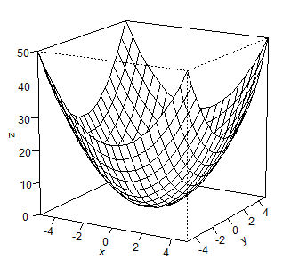
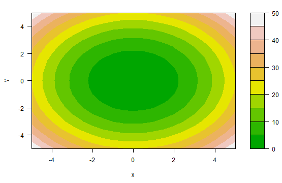
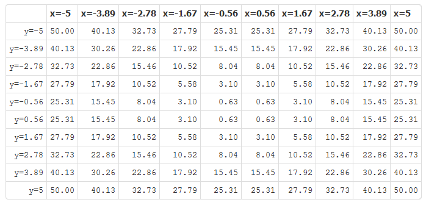

##  <font color="blue">Visualizing Functions</font>

- Functions of both 1 and 2 variables can be easily visualized.  
- Students spend quite a bit of time learning to graph or display in a table functions of 1 variable.
- Yet, because of time constaints, often much less time is devoted to visualizing functions of 2 variables.
- Visualizing functions of 2 variables can be easily accomplished via a computer or graphing calculator.

This web application--created using Shiny--helps students to visualize functions of 2 variables (meaning 2 independent variables corresponding to a single dependent variable) by displaying such functions as a surface plot, a contour plot, or a table of values.


--- .class #id 

## <font color="blue">Functions of Interest</font>

A choice of function to visualize can be chosen from a list of important functions, selected both for their common usage as well as distinct forms.
- $x^2+y^2$ a paraboloid
- $e^{-(x^2+y^2)}$ an exponential 
- $x^2-y^2$ a saddle
- $xy$ a hyperbolic paraboloid
- $\cos(x)+\sin(y)$ a periodic function
- $x+y$ a plane
- $\sqrt(x^2+y^2)$ a cone
- $-y^2$ a parabolic cylinder

The domain of input values over which to visualize the chosen function may be selected using sliders.

--- .class #id 

## <font color="blue">An Example</font>

Function $x^2+y^2$ over the domain $-5\leq x \leq 5$  and $-5 \leq y \leq 5$





  
Surface plot, contour plot, table


--- .class #id 

## <font color="blue">Evaluation at Specified Input</font>

Finally, a user may input specific x and y values at which to evaluate the selected function. 

For example,

```r
myfun <- function (x,y) {
   x^2+y^2
 } 
myfun(x=3,y=7)
```

```
## [1] 58
```

<h2><font color="blue">Conclusion</font></h2>

<SPAN style="BACKGROUND-COLOR: orange">This web application provides an interactive tool to easily visualize common functions of two variables by displaying the functions using three different methods, while using reactive arguments to update input domains and evaluate the function.</SPAN>


